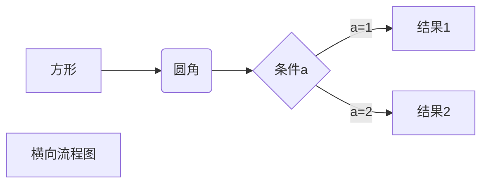
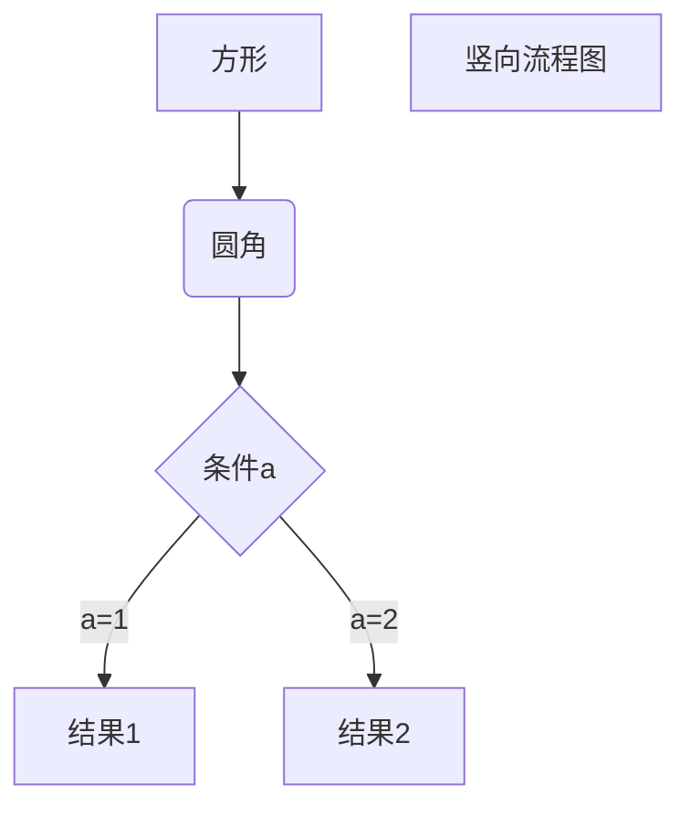
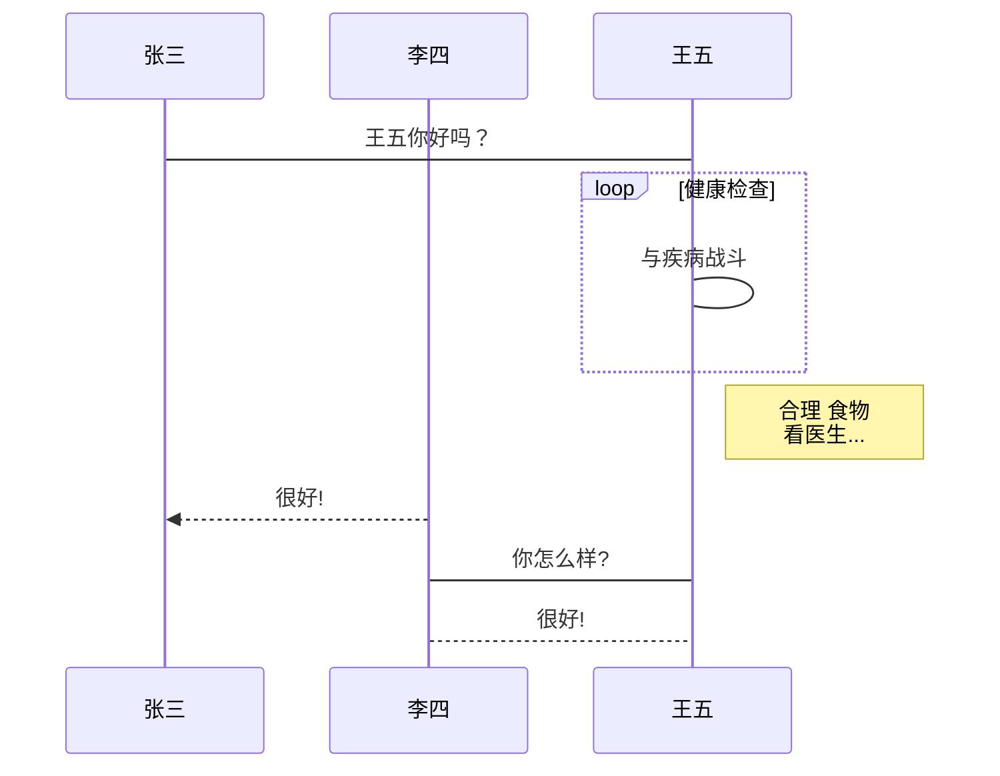
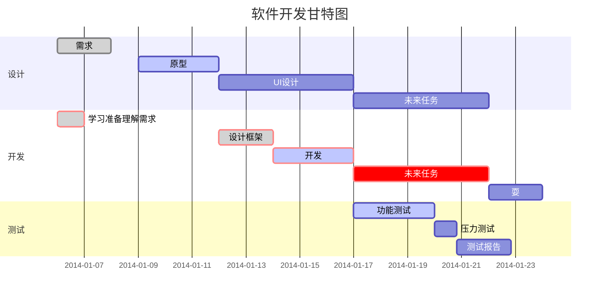

# 标题

## 1、使用 = 和 -  标记一级标题和二级标题

```markdown
我是一级标题
=============
我是二级标题
-------------
```

显示效果：


## 2、使用 # 标记标题

使用 **#** 号可表示 1-6 级标题，一级标题对应一个 **#** 号，二级标题对应两个 **#** 号，以此类推。

```markdown
# 一级标题
## 二级标题
### 三级标题
#### 四级标题
##### 五级标题
###### 六级标题
```

显示效果：


# 段落

## 1、**段落的换行是使用两个以上空格加上回车**

```markdown
段落一（两个以上空格加上回车)
段落二
```

显示效果：


## 2、可以在段落后面使用一个空行来表示重新开始一个段落

```markdown
我是段落一
（空行）
我是段落二
```

显示效果：


# 字体

## 1、斜体文本

```markdown
*我是斜体文本*  

_我也是斜体文本_
```

显示效果：


## 2、粗体文本

```markdown
**我是粗体文本**  

__我也是粗体文本__
```

显示效果：


## 3、粗斜体文本

```markdown
***我是粗斜体文本***

___我也是粗斜体文本___
```

显示效果：


# 分割线

你可以在一行中用三个以上的**星号**（*）、**减号**（-)、**底线**（_）来建立一个分隔线，行内不能有其他东西(可以有空格)

```markdown
*******
* * * * *

---------
- - - - -

__________
_ _ _ _ _ _
```

显示效果：


# 删除线

如果段落上的文字要添加删除线，只需要在文字的两端加上**两个波浪线 ~~** 即可

```markdown
茫茫人海中的小菜，现实的压力太大，我~~不想努力不想成功~~太想成功了!
```

# 下划线

下划线可以通过 HTML 的 **<u>** 标签来实现：

```markdown
<u>我是带下划线的文本</u>
```

显示效果：


# 脚注

脚注是对文本的补充说明。

```markdown
我创建的脚注 [^mark]

[^mark]:初次见面，请多多关照
```

显示效果：

我创建的脚注 [^mark]

[^mark]:初次见面，请多多关照

# 列表

## 1、无序列表

无序列表使用**星号**(*****)、**加号**(**+**)或是**减号**(**-**)作为列表标记，这些标记后面要添加一个**空格**，然后再填写内容：

```markdown
* 第一项
* 第二项
* 第三项

+ 第一项
+ 第二项
+ 第三项

- 第一项
- 第二项
- 第三项
```

显示效果：


## 2、有序列表

有序列表使用数字并加上 **.** 号和**空格**来表示

```markdown
1. 第一项
2. 第二项
3. 第三项
```

显示效果：


## 3、列表嵌套

列表嵌套只需在子列表中的选项前面添加四个空格即可

```markdown
1. 第一项
    * 第一项的第一子项
    * 第一项的第二子项
2. 第二项
    + 第二项的第一子项
    + 第二项的第二子项
3. 第三项
    - 第三项的第一子项
    - 第三项的第二子项
```

显示效果：


# 区块

## 1、Markdown 区块引用是在段落开头使用 **>** 符号 ，然后后面紧跟一个**空格**符号


```
> 我有时候就在想 如果余生你都不主动找我 是不是这辈子都不会再与你有交集了 可是只要你和我说话 我看见了一定秒回 或者你说想见我 就算是刀山火海也要以最快的速度出现在你的面前 但你不找我 我应该真的不会出再现在你的世界里了
```

> 我有时候就在想 如果余生你都不主动找我 是不是这辈子都不会再与你有交集了 可是只要你和我说话 我看见了一定秒回 或者你说想见我 就算是刀山火海也要以最快的速度出现在你的面前 但你不找我 我应该真的不会出再现在你的世界里了

## 2、另外区块是可以嵌套的，一个 **>** 符号是最外层，两个 **>** 符号是第一层嵌套，以此类推：

```markdown
> 不想这样，却也只能这样
>> 衣不如新，人不如旧
>>> 你的气质里藏着你走过的路和你阅过得人
```

> 不想这样，却也只能这样
> > 衣不如新，人不如旧
> >
> > > 你的气质里藏着你走过的路和你阅过得人

## 3、区块中使用列表

```m
> 本季度收录语录
> 1. 励志
     * 心有多大，舞台就有多大
     * 虽然我走的慢，但我从不退后
> 2. 伤感
     + 何苦一往情深
     + 以我之笔，叙你之心
```

> 本季度收录语录
> 1. 励志
>    * 心有多大，舞台就有多大
>    * 虽然我走的慢，但我从不退后
> 2. 伤感
>    + 何苦一往情深
>    + 以我之笔，叙你之心

## 4、列表中使用区块

如果要在列表项目内放进区块，那么就需要在 **>** 前添加**四个空格**的缩进

```
1. 励志语录
    > + 我可以失望，但不能盲目
    > + 逆风的方向，更适合飞翔，我不怕千万人阻挡，只怕自己投降
2. 情感语录
    > * 一连十六卦，卦卦皆无你
    > * 你不是真的快乐
```

1. 励志语录
    > + 我可以失望，但不能盲目
    > + 逆风的方向，更适合飞翔，我不怕千万人阻挡，只怕自己投降
2. 情感语录
    > * 一连十六卦，卦卦皆无你
    > * 你不是真的快乐

# 代码

## 1、段落上的一个函数或片段的代码

如果是段落上的一个函数或片段的代码可以用反引号把它包起来（**`**）

```markdown
C语言中想要在屏幕上输出数据可以使用`printf()`函数
```

C语言中想要在屏幕上输出数据可以使用`printf()`函数

## 2、代码区块 

代码区块使用 **4 个空格**或者一个**制表符（Tab 键）**

```c
int main()
{
	printf("Hello World\n");
    system("pause");
    return EXIT_SUCCESS;
}
```

也可以用 **```** 包裹一段代码，并指定一种语言（也可以不指定）

``` c
int main(int argc,int *argc)
{
	printf("Hello World\n");
    system("pause");
    return EXIT_SUCCESS;
}
```

# 链接

## 1、连接名+链接地址

``` markdown
[链接名称](链接地址)
哈哈哈这里是我最爱的[百度](www.baidu.com)
```

哈哈哈这里是我最爱的[百度](www.baidu.com)

## 2、直接使用链接地址

```markdown
<http://www.bilibili.com>
```

<http://www.bilibili.com>

## 3、高级链接

可以通过变量来设置一个链接，变量赋值在文档末尾进行：

```markdown
这里是[百度][1]

这里才是[腾讯][2]

你要找的[b站][3]在这里
[1]:http://www.baidu.com
[2]:https://www.tencent.com
[3]:http://www.bilibili.com
```

这里是[百度][1]

这里才是[腾讯][2]

你要找的[b站][3]在这里
[1]:http://www.baidu.com
[2]:https://www.tencent.com
[3]:http://www.bilibili.com

# 图片

``` makefile


```


当然，你也可以像网址那样对图片网址使用变量

```markdown
这里是个[小姐姐][1]
[1]:/小姐姐.jpg
```

这里是个[小姐姐][1]

[1]:/小姐姐.jpg

# 表格

## 1、Markdown 制作表格使用 **|** 来分隔不同的单元格，使用 **-** 来分隔表头和其他行

```markdown
|姓名|学号|成绩|
|---|---|---|
|吉吉|1001|88|
|毛毛|1002|89|
|蛋蛋|1003|90|
```

| 姓名 | 学号 | 成绩 |
| ---- | ---- | ---- |
| 吉吉 | 1001 | 88   |
| 毛毛 | 1002 | 89   |
| 蛋蛋 | 1003 | 90   |

## 2、对齐方式

> 1. **-:** 设置内容和标题栏居右对齐。
> 2. **:-** 设置内容和标题栏居左对齐。
> 3. **:-:** 设置内容和标题栏居中对齐。

```markdown
|姓名（左对齐）|学号（右对齐）|成绩（居中对齐）|
|:----|----:|:----:|
|吉吉|1001|88|
|毛毛|1002|89|
|蛋蛋|1003|90|
```

| 姓名（左对齐） | 学号（右对齐） | 成绩（居中对齐） |
| :------------- | -------------: | :--------------: |
| 吉吉           |           1001 |        88        |
| 毛毛           |           1002 |        89        |
| 蛋蛋           |           1003 |        90        |

# typora画流程图

## 1、横向流程图--mermaid

```
graph LR
A[方形] -->B(圆角)
    B --> C{条件a}
    C -->|a=1| D[结果1]
    C -->|a=2| E[结果2]
    F[横向流程图]
```




## 2、竖向流程图--mermaid

```
graph TD
A[方形] -->B(圆角)
    B --> C{条件a}
    C -->|a=1| D[结果1]
    C -->|a=2| E[结果2]
    F[竖向流程图]
```




## 3、标准流程图（竖向）--flow

```
st=>start: 开始框
op=>operation: 处理框
cond=>condition: 判断框(是或否?)
sub1=>subroutine: 子流程
io=>inputoutput: 输入输出框
e=>end: 结束框
st->op->cond
cond(yes)->io->e
cond(no)->sub1(right)->op
```


```flow
st=>start: 开始框
op=>operation: 处理框
cond=>condition: 判断框(是或否?)
sub1=>subroutine: 子流程
io=>inputoutput: 输入输出框
e=>end: 结束框
st->op->cond
cond(yes)->io->e
cond(no)->sub1(right)->op
```

## 4、标准流程图（横向）--flow

```
st=>start: 开始框
op=>operation: 处理框
cond=>condition: 判断框(是或否？)
sub1=>subroutine: 子流程
io=>inputoutput: 输入输出框
e=>end: 结束框
st(right)->op(right)->cond
cond(yes)->io(bottom)->e
cond(no)->sub1(right)->op
```


```flow
st=>start: 开始框
op=>operation: 处理框
cond=>condition: 判断框(是或否？)
sub1=>subroutine: 子流程
io=>inputoutput: 输入输出框
e=>end: 结束框
st(right)->op(right)->cond
cond(yes)->io(bottom)->e
cond(no)->sub1(right)->op
```

## 5、UML时序图--sequence

```
对象A->对象B: 对象B你好吗?（请求）
Note right of 对象B: 对象B的描述
Note left of 对象A: 对象A的描述(提示)
对象B-->对象A: 我很好(响应)
对象A->对象B: 你真的好吗？
```


```sequence
对象A->对象B: 对象B你好吗?（请求）
Note right of 对象B: 对象B的描述
Note left of 对象A: 对象A的描述(提示)
对象B-->对象A: 我很好(响应)
对象A->对象B: 你真的好吗？
```

##  6、UML复杂时序图--sequence

```
Title: 标题：复杂使用
对象A->对象B: 对象B你好吗?（请求）
Note right of 对象B: 对象B的描述
Note left of 对象A: 对象A的描述(提示)
对象B-->对象A: 我很好(响应)
对象B->小三: 你好吗
小三-->>对象A: 对象B找我了
对象A->对象B: 你真的好吗？
Note over 小三,对象B: 我们是朋友
participant C
Note right of C: 没人陪我玩
```


```sequence
Title: 标题：复杂使用
对象A->对象B: 对象B你好吗?（请求）
Note right of 对象B: 对象B的描述
Note left of 对象A: 对象A的描述(提示)
对象B-->对象A: 我很好(响应)
对象B->小三: 你好吗
小三-->>对象A: 对象B找我了
对象A->对象B: 你真的好吗？
Note over 小三,对象B: 我们是朋友
participant C
Note right of C: 没人陪我玩
```

## 7、UML标准时序图--mermaid

```
%% 时序图例子,-> 直线，-->虚线，->>实线箭头
  sequenceDiagram
    participant 张三
    participant 李四
    张三->王五: 王五你好吗？
    loop 健康检查
        王五->王五: 与疾病战斗
    end
    Note right of 王五: 合理 食物 <br/>看医生...
    李四-->>张三: 很好!
    王五->李四: 你怎么样?
    李四-->王五: 很好!
```




## 8、甘特图--mermaid

```
%% 语法示例
        gantt
        dateFormat  YYYY-MM-DD
        title 软件开发甘特图
        section 设计
        需求                      :done,    des1, 2014-01-06,2014-01-08
        原型                      :active,  des2, 2014-01-09, 3d
        UI设计                     :         des3, after des2, 5d
    未来任务                     :         des4, after des3, 5d
        section 开发
        学习准备理解需求                      :crit, done, 2014-01-06,24h
        设计框架                             :crit, done, after des2, 2d
        开发                                 :crit, active, 3d
        未来任务                              :crit, 5d
        耍                                   :2d
        section 测试
        功能测试                              :active, a1, after des3, 3d
        压力测试                               :after a1  , 20h
        测试报告                               : 48h
```




